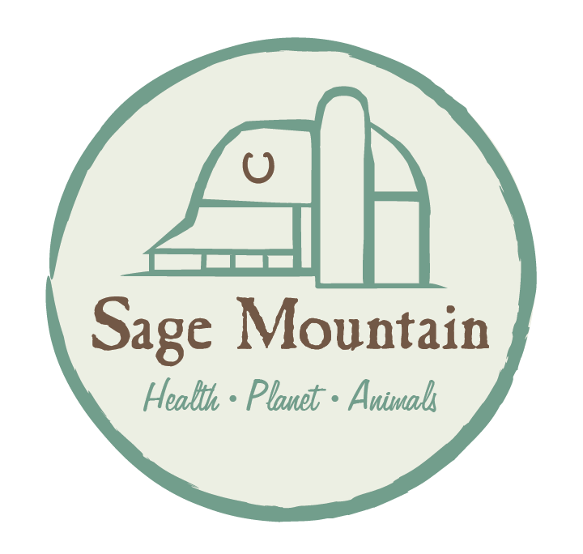

# Logos

The real Sage Mountain Sanctuary logo, saved from the live site (sagemtn.org). This file just documents where it lives — the actual image file is the source of truth, not a copy pasted in here.

**Location**: `Website/public/images/logo.webp`

It's a circular badge mark — cream background, a moss-green ring, a line-drawn barn/silo illustration, "Sage Mountain" in a warm brown serif, and "Health · Planet · Animals" underneath in green script.

**In use**: this is now rendered in the site header and footer (`Website/components/site-header.tsx`, `Website/components/site-footer.tsx`) in place of the placeholder paw-print icon.

If additional logo variants are added later (a horizontal lockup, a reversed/white version for dark backgrounds, a square favicon crop, etc.), save them alongside the original in `Website/public/images/` with clear filenames and note them here.
